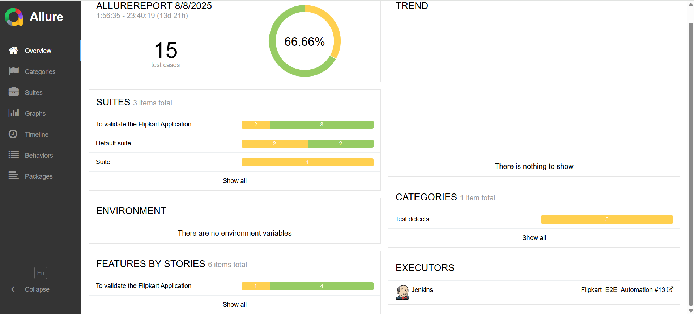

## Flipkart E2E Automation (Selenium + Cucumber + TestNG)

End‑to‑end UI automation framework for Flipkart built with Java, Selenium 4, Cucumber 7 (BDD), and TestNG. Generates Allure and Extent reports out of the box and is CI‑ready for Jenkins.

Repository: `https://github.com/Roushan7970835758/Flipcart_E2E_Automation`

### Tech stack
- **Language**: Java 21
- **Build**: Maven 3.9+
- **Test Runner**: TestNG + Cucumber 7 (`com.TestRunner.Runner`)
- **UI Automation**: Selenium WebDriver 4, WebDriverManager
- **BDD**: Gherkin feature files under `src/test/resources/Features`
- **Reports**: Allure (Maven plugin), ExtentReports (Spark adapter)
- **Data**: Apache POI for Excel (`testData/flipkartTestData.xlsx`)
- **Logging**: SLF4J Simple
- **Optional**: RestAssured, Appium client libraries are present for future API/Mobile modules

### Project structure (key folders)
```text
Flipkart_E2E_Project/
 ├─ src/
 │  ├─ main/java/com/
 │  │  ├─ BaseClass/            # WebDriver setup, shared library
 │  │  ├─ Hooks/                # Cucumber hooks
 │  │  ├─ ReusableFunctions/    # Selenium helpers
 │  │  └─ Utilities/            # Excel + thread local utils
 │  └─ test/java/com/
 │     ├─ Pages/                # Page Objects
 │     ├─ Stepdefenitions/      # Step Definitions
 │     └─ TestRunner/Runner.java# Cucumber + TestNG runner
 │
 ├─ src/test/resources/
 │  ├─ Features/                # .feature files
 │  ├─ Properties/config.Property
 │  ├─ config.Properties/       # environment configs
 │  └─ extent.properties        # Extent report config
 │
 ├─ testData/flipkartTestData.xlsx
 ├─ testng.xml                  # Executes Runner via TestNG
 ├─ allure-results/             # Raw results (generated)
 └─ target/                     # Build output, reports, screenshots
```

### How to clone
```bash
git clone https://github.com/Roushan7970835758/Flipcart_E2E_Automation.git
cd Flipcart_E2E_Automation
```

### Prerequisites
- Java 21 (set `JAVA_HOME` accordingly)
- Maven 3.9+
- Chrome or any modern browser (drivers are handled by WebDriverManager)
- Optional for viewing Allure reports locally:
  - Windows: `choco install allure` or `scoop install allure`
  - macOS: `brew install allure`

### How to run tests

- From command line (default `@Regression` tag via `Runner`):
```bash
mvn clean test
```

- Generate and open Allure report (any one of the below):
```bash
# Option A: Use Maven plugin to build the static report
mvn allure:report && start target/site/allure-maven/index.html

# Option B: Serve dynamically if Allure CLI is installed
allure serve allure-results
```

- Override Cucumber tags from CLI (example: run @Smoke only):
```bash
mvn clean test -Dcucumber.filter.tags="@Smoke"
```

- Run from IDE:
  - Open `testng.xml` and run, or
  - Run `com.TestRunner.Runner` directly.

### Reports & artifacts
- **Extent HTML**: `target/extent-reports/Flipkart.html`
- **Allure static** (via Maven): `target/site/allure-maven/index.html`
- **Screenshots**: `target/extent-reports/screenshots/` and `target/screenshots/`

### Screenshots
Images placed at the repository root have been embedded below:




### Jenkins (optional)
This project is CI‑ready. A simple Freestyle or Pipeline job can use:
```bash
mvn -B clean test
mvn -B allure:report
```
Then publish `target/site/allure-maven` as an HTML report or use the Allure Jenkins plugin.

### Useful references
- Repository: `https://github.com/Roushan7970835758/Flipcart_E2E_Automation`
- Runner: `src/test/java/com/TestRunner/Runner.java`
- Config: `src/test/resources/extent.properties`, `src/test/resources/Properties/config.Property`


